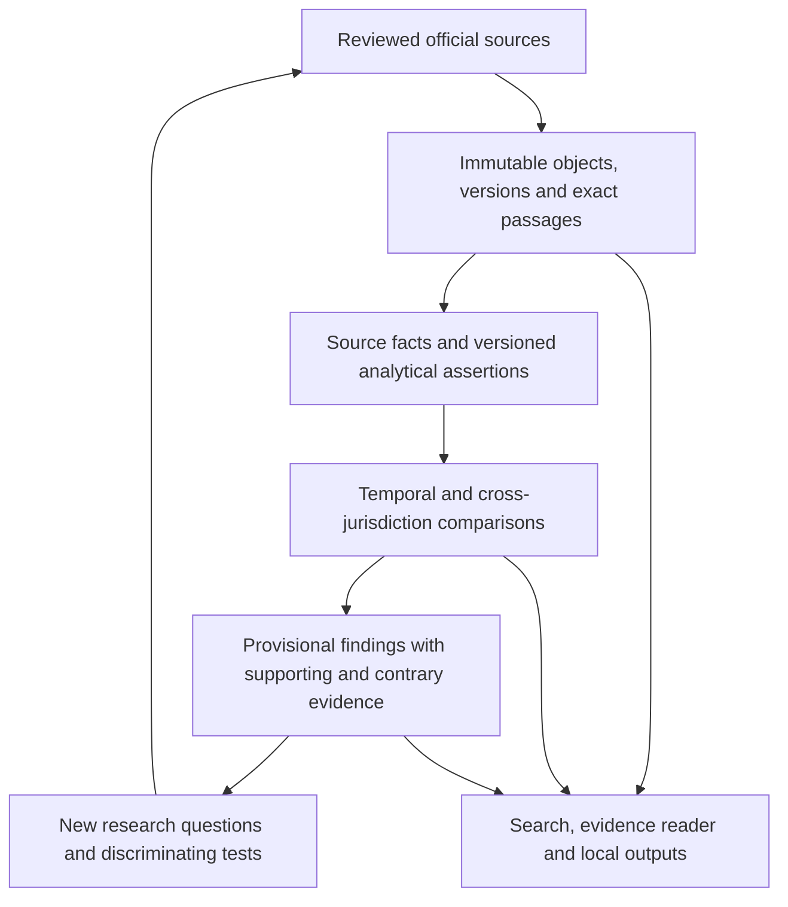

# Policy Sentinel: real policy systems research and strategic correction

Prepared 2026-09-05. Research baseline: `main` at
`2d91e860df3b8fcbe84e47c6e6563201d5f7693e`.

This is the evidence and reasoning behind the
[next-session implementation prompt](../handoffs/ps09-real-policy-discovery-launch.md).
The owner requested public research, parallel agents, systems thinking, and a
prompt that advances from synthetic preparation to an implemented real-policy
system. This session researches and prepares that launch; it does not acquire
a product corpus or claim that a source or new capability is already admitted.

## The direction worth recovering

The owner wants to discover how policies work together, change over time, and
relate to institutions and the conditions that produce policy. Explicit use
cases can help test that ambition, but requiring a complete list before
building would defeat part of its purpose. The system should help formulate
better questions from evidence as well as answer questions already known.

This direction was present before this conversation. The protected owner
Program Plan dated 2026-09-05 says synthetic fixtures must cease to be the
standing product-data boundary. It calls for a broad discovery corpus, a
smaller deeply checked corpus, real full text, precise citations, temporal
relations, and common outputs. Its dependency discussion permits general
jurisdiction acquisition while particular identity claims remain unresolved.
These inputs remain unchanged under the
[custody manifest](ps09-run-01-custody.json); they are design direction, not
evidence that those capabilities exist.

The corrective goal is a useful local policy research workbench over one
canonical corpus. A researcher should be able to find actual documents,
inspect the passages behind a result, trace a documented change, compare
institutional structures across governmental contexts, and investigate a
candidate pattern. That workflow should expose missing evidence and invite
revision of the model.

## What failed, and what remains sound

The shell failure was concrete: EV01 expected persistent standard input, but
the actual shell invocation closed input after local ledger creation. No
source operation was reserved or dispatched. The
[recovery guide](../handoffs/ps09-fresh-session-recovery-and-forward-plan.md)
records the subsequent successful argv diagnostics, incomplete runner work,
and the immutable terminal evidence. One operation per invocation remains a
sound repair. It is an enabling component of the new goal.

The larger failure was a mismatch between ambition and execution boundaries:

- The implemented corpus rejects real inputs, and the curated-pack path
  accepts only owned synthetic UTF-8 text. Passing those tests proves the
  implemented subset; it cannot show usefulness on policy documents.
- The current sequential PS09 graph makes the whole identity stage a
  prerequisite for general federal work. The owner's program described
  narrower contract dependencies. An unresolved current-membership claim
  should block that claim, not unrelated policy retrieval.
- The retained application requires a Nation search context and searches a
  limited record representation. General policy investigation and temporal
  full-text comparison need deliberate integration work.
- Earlier portfolio transports returned HTML, but the project observer
  rejected most responses; two exceeded its chunk-count bound. Those results
  identify observer limitations, not proof that the sources are unusable.
- Hashes establish captured-byte identity. They do not establish semantic
  truth, prove that review text reached a reviewer, or make every changed
  navigation element a substantive source-contract change.

The evidence-first custody design, exact citation replay, distinct authority
roles, non-inference rules, and one canonical corpus remain useful. The
correction is to make them support real investigation and source-specific
decisions. Missing formal schemas, SLAs, or published numeric rate limits
require an engineering response proportionate to the uncertainty; they do
not automatically require another general owner interview.

Verified implementation references include
[the corpus ADR](../adr/ps09-canonical-corpus.md),
[analyzed-corpus runtime](../../src/pipeline/analyzed-corpus.mjs),
[curated document packs](../../src/pipeline/curated-document-pack.mjs),
[corpus store](../../src/pipeline/corpus-store.mjs),
[application criteria](../../src/app/types.ts), and
[application filtering](../../src/app/policy.ts).

## Research that changes the design

The research agent inspected the open primary texts below on 2026-09-05.
The implementation implications are our synthesis. These papers are research
inputs, not source-admission decisions or permission to import their datasets.

| Primary work | Useful contribution | Consequence and limit |
| --- | --- | --- |
| Frantz and Siddiki, [IG 2.0 Codebook v1.4](https://newinstitutionalgrammar.org/resources/IG%202.0%20Codebook%20v1.4.pdf), conceptual foundations and study-design checklist | Institutional statements distinguish actors, actions, objects, obligations or permissions, conditions, constraints, and constitutive structures. Coding requires conventions and interpretational scope. | Start with a small versioned comparison vocabulary. A component assigned by an analyst is an assertion about a passage, with its own method and review state. |
| Coupette et al., [Measuring Law Over Time](https://www.frontiersin.org/journals/physics/articles/10.3389/fphy.2021.658463/full), 2021 | Models document hierarchy, sequence, and references in temporal snapshots of US and German statutes and regulations. | Preserve provisions and versions; compare reference neighborhoods alongside text. Citation density does not establish significance, precedence, or policy effects. |
| Merigoux et al., [Catala](https://arxiv.org/pdf/2103.03198), 2021 | Represents computational subsets of law with prioritized defaults and exceptions linked to legal text. | Preserve exceptions and trace each formalization. Correct execution cannot prove correct legal interpretation; a discovery system need not become an eligibility engine. |
| Desmarais, Harden and Boehmke, [Persistent Policy Pathways](https://myweb.uiowa.edu/fboehmke/shambaugh2014/papers/desmarais_etal_2014.pdf), open 2014 manuscript, subsequently published in 2015 | Infers policy diffusion using earlier adoption sequences, tuning, and external checks. | Use temporal holdouts and rival explanations. Temporal association and similar wording do not establish influence or causation. |
| Mettler and Soss, [The Consequences of Public Policy for Democratic Citizenship](https://suzannemettler.weebly.com/uploads/1/0/8/8/108858037/3688340.pdf), 2004 | Policy can reshape participation, capacities, agendas, and subsequent politics. | Design for feedback questions. Text alone cannot show experienced effects or public attitudes; these require additional evidence. Citizenship theory does not define Nation identity. |
| Mohun and Roberts, OECD, [Cracking the Code](https://www.oecd.org/content/dam/oecd/en/publications/reports/2020/10/dechiffrer-le-code_d56cab77/3afe6ba5-en.pdf), 2020 | Rules as Code involves legal, policy, and technical interpretation; prescriptive rules with little discretion are common starting points. | Encoding is a substantive modeling act. Preserve original language beside any analytical representation and avoid pretending all law is computationally determinate. |
| Pipitone and Alami, [LegalBench-RAG](https://arxiv.org/html/2408.10343v1), 2024 | Evaluates retrieval against exact supporting spans separately from answer generation. The benchmark's questions use individual documents. | Test passage recovery directly and add cross-document, version, and jurisdiction questions. Generic retrieval scores do not establish policy-archaeology capability. |

There are substantial precedents. This survey cannot establish that the entire
concept is unprecedented. Its distinctive contribution may be the combination
of sovereignty-centered evidence, temporal institutional analysis, and an
effective discovery workflow. Novelty should be assessed as concrete
capabilities emerge.

## Public implementations inspected

The GitHub agent inspected actual models, schemas, selected tests and license
files through `gh` on 2026-09-05. Links are pinned to the inspected commits.
No third-party tests were run. Activity is not proof of correctness or fitness;
software licenses do not establish rights to every dataset a project uses.

| Precedent | Inspected mechanism | Transfer and limit |
| --- | --- | --- |
| CourtListener | [Opinion models](https://github.com/freelawproject/courtlistener/blob/eb730ab15035561a8f0cd6d4a691b336266dcee0/cl/search/models.py) distinguish clusters, opinions, original files and extracted/annotated text. [Citation tests](https://github.com/freelawproject/courtlistener/blob/eb730ab15035561a8f0cd6d4a691b336266dcee0/cl/citations/tests.py) cover ambiguity and resolution failures. | Separate identity, rendition and resolution; keep unresolved citations. Model comments still describe some versioning as future work. [AGPL-3.0-or-later](https://github.com/freelawproject/courtlistener/blob/eb730ab15035561a8f0cd6d4a691b336266dcee0/LICENSE.txt). |
| eyecite | [Resolver](https://github.com/freelawproject/eyecite/blob/047af17e13806a437e75f2ea85cb9615f69516c3/eyecite/resolve.py) and [tests](https://github.com/freelawproject/eyecite/blob/047af17e13806a437e75f2ea85cb9615f69516c3/tests/test_ResolveTest.py) distinguish full/short/supra/id references and leave ambiguous cases unresolved. | Capture occurrences before resolving targets. A grouped reference is not an authoritative target or legal treatment. A future dependency would need jurisdiction-specific evaluation and a justified Python stage. [BSD-2-Clause](https://github.com/freelawproject/eyecite/blob/047af17e13806a437e75f2ea85cb9615f69516c3/LICENSE). |
| OpenStates core | [Bill models](https://github.com/openstates/openstates-core/blob/c3ba999044cc1e7310a12b94b4e47c7bb12b2f18/openstates/data/models/bill.py) and [tests](https://github.com/openstates/openstates-core/blob/c3ba999044cc1e7310a12b94b4e47c7bb12b2f18/openstates/scrape/tests/test_bill_scrape.py) distinguish sessions, ordered actions, versions, supporting documents, sources and partial dates. | Model documentary families and events. Do not inherit scraper classifications as official taxonomy or sponsorship as Nation evidence. [MIT](https://github.com/openstates/openstates-core/blob/c3ba999044cc1e7310a12b94b4e47c7bb12b2f18/LICENSE). |
| Indigo / Laws.Africa | [Work models](https://github.com/laws-africa/indigo/blob/652e58fca163f5974b96c4979dea563cd8c85919/indigo_api/models/works.py), [document models](https://github.com/laws-africa/indigo/blob/652e58fca163f5974b96c4979dea563cd8c85919/indigo_api/models/documents.py) and [commencement tests](https://github.com/laws-africa/indigo/blob/652e58fca163f5974b96c4979dea563cd8c85919/indigo_api/tests/test_commencements.py) distinguish works, dated expressions, amendments and provision-level commencement. | Strong temporal precedent. Some tests return earliest-expression provisions for pre-publication dates; Policy Sentinel should preserve absence of earlier evidence rather than inherit that as historical truth. [LGPL-3.0-or-later](https://github.com/laws-africa/indigo/blob/652e58fca163f5974b96c4979dea563cd8c85919/LICENSE). |
| GPO USLM | [Components schema](https://github.com/usgpo/uslm/blob/100338992150c276aae5544d01d9b821a27eb383/uslm-components-2.1.0.xsd) contains provision identifiers, version-qualified references and temporal attributes; `startPeriod` is explicitly distinct from an effective date. [Version samples](https://github.com/usgpo/uslm/tree/100338992150c276aae5544d01d9b821a27eb383/bill-version-samples-september-2024) provide examples. | Prefer official structure where available. Schema/sample inspection does not prove parser interoperability; no automated suite was inspected. [Project public-domain/CC0 statement](https://github.com/usgpo/uslm/blob/100338992150c276aae5544d01d9b821a27eb383/LICENSE.md). |
| OpenFisca core | [Dated variables](https://github.com/openfisca/openfisca-core/blob/0e4be150c2697c8581c648ec72bd241e3fa2e6f8/openfisca_core/variables/variable.py) and [parameter tests](https://github.com/openfisca/openfisca-core/blob/0e4be150c2697c8581c648ec72bd241e3fa2e6f8/tests/core/test_parameters.py) preserve historical values, legislative references and before-definition/end-of-life errors. | Transparent dated mechanisms are useful. Domain modelers supply the rules; the engine does not discover legal applicability or causality from documents. [AGPL-3.0](https://github.com/openfisca/openfisca-core/blob/0e4be150c2697c8581c648ec72bd241e3fa2e6f8/LICENSE). |
| unitedstates/uscode | [Table III parser](https://github.com/unitedstates/uscode/blob/21c7a184dd8ae40ce97d87436aeb96d6f3b28324/table3/ParseTable.py) maps public-law sections to Code sections. The discovered [locator test file](https://github.com/unitedstates/uscode/blob/21c7a184dd8ae40ce97d87436aeb96d6f3b28324/test/gpolocator-tests.py) has commented-out assertions and a debugger breakpoint. | Follow official classification/source-credit tables for archaeology. Repository archived, latest push observed 2014-06-08: historical reference, not a maintained parser recommendation. [CC0](https://github.com/unitedstates/uscode/blob/21c7a184dd8ae40ce97d87436aeb96d6f3b28324/LICENSE). |

The first six showed recent repository activity at inspection, but no CI
status or production-quality conclusion follows. A graph database or a
wholesale framework migration is unnecessary to test these mechanisms in the
current engine. Prefer the smallest compatible implementation with explicit
source and method provenance.

## Official access routes worth implementing first

The following primary documentation was inspected on 2026-09-05. These are
credible candidates for the next session, not live adapter qualifications.
No product acquisition, payload parser canary, or complete source-specific
reuse review was performed here.

| Route | Verified documentation | Next-session implication |
| --- | --- | --- |
| GovInfo bulk and direct renditions | The [Developer Hub](https://www.govinfo.gov/developers) distinguishes the keyed API from bulk XML and XML/JSON bulk directory endpoints. Collections include bill text/status, annual CFR, Federal Register, statutes, and other materials. | Use exact selected files or bounded directory pages. A blocked API credential interface does not by itself block a separately reviewed public bulk interface. Do not download entire collections by default. |
| GovInfo custody and reuse | [GovInfo policies](https://www.govinfo.gov/about/policies) discuss local content packages, federal government works, third-party copyrighted inclusions, and attribution. | Review the selected material and each intended use. Website graphics or third-party inclusions are not covered by a blanket government-work assumption. |
| Federal Register bulk XML | The [OFR/GPO XML guide](https://www.govinfo.gov/bulkdata/FR/resources/FDsys_OFR-XML_User-Guide-v1.pdf) documents downstream use and warns of markup inconsistencies and distinctions between user aids and legal text. It is a historical guide still linked by the service. | Useful technical and reuse evidence; recheck current collection and rendition authority. Do not treat the guide's historical statements about authentication as current legal-status verification. |
| eCFR historical API | [REST API documentation guidance](https://www.ecfr.gov/reader-aids/ecfr-developer-resources/rest-api-interactive-documentation) explicitly describes historical transformations and says keys are unnecessary. [Date guidance](https://www.ecfr.gov/reader-aids/ecfr-developer-resources/understanding-ecfr-dates) distinguishes amendment, issue, and up-to-date dates. | Strong candidate for version-aware retrieval. Verify endpoint parameters, actual returned fields, rights and rendition status before acquisition. The interactive documentation page's static extraction did not expose its full endpoint contract in this session. |
| Washington WAC | The [official index](https://app.leg.wa.gov/wac/) describes twice-monthly online updates, archives since 2004, and certified archive PDFs as the official publication. | Candidate for a contrasting state context through exact reviewed documents. This observation does not qualify an automated interface, establish text reuse, or prove a chosen historical chain. |
| OLRC United States Code | Official search results identified release-point downloads and USLM guidance. Direct opens of the download page failed in this research surface. | Retain as a candidate with an explicit access-evidence gap. Do not describe the download interface as independently verified in this session. |

Prioritize eCFR and GovInfo because the inspected documentation gives specific
public structured routes. Reuse the existing PNW scenario catalog to choose a
contrasting regional family. Official Tribal or intertribal documents remain
valuable candidates attributed to their actual issuer; their participation
does not depend on a complete membership directory. Restricted libraries can
remain discovery references while an independently accessible originating
source supplies the document. No credentials, subscription, provider contact,
or terms acceptance is implicit in this recommendation.

## A system that can learn without making its conclusions authoritative

Keep source facts, deterministic structural measurements, analytical
annotations, and hypotheses distinguishable. Each analytical result needs
its input set, method version, supporting passages, uncertainty, and review
state. It must remain possible to reject an interpretation without changing
the captured source or losing the history of the earlier interpretation.

Good initial comparison dimensions include institutional responsibility,
participation procedures, reporting and review requirements, triggers,
exceptions, deadlines, and changes to definitions. They can span legal forms
and governments without claiming that similarly named bodies or rules are
equivalent. Government relationships are typed evidence-bearing relations,
not a universal nesting of sovereign Nations below states or counties.

Record publication, source-stated enactment/effectiveness, amendment/repeal,
version observation, and retrieval separately. A publication date is not an
effective date. Source status is not a legal conclusion. Distinguish an
instrument's revision from a change to its HTML or OCR rendition.

Public policymakers can appear through documented official roles, sponsorship,
votes, appointments, or other institutional actions where the selected source
supports them. This does not justify inferring motives, ideology, community
positions, causation, or private relationships. Explaining changes in the
polity requires evidence beyond mere co-occurrence in document text.

The aim for a claim is inspectability and testability. A compelling pattern
is a reason to investigate. Require comparison populations, denominators,
negative cases, and competing explanations such as boilerplate, shared
upstream language, coverage gaps, and formatting artifacts. Finding no
supported pattern is a legitimate result.

## What would constitute meaningful progress

The launch prompt requires a local workbench over real documents, with two
connected scenario families, at least three instrument classes, and at least
two distinct governmental contexts including a PNW context. It asks for
12–20 deeply checked real documents, actual version/status chains, and a
broader discovery corpus when practical. The owner's 200–1,000 record band is
a discovery/performance target, not a replacement for evidentiary diversity.

Gold expectations should be prepared independently of implementation output.
Evaluate exact passage recovery, document/version correspondence, unsupported
link rejection, temporal filtering, question-specific evidence sufficiency,
and preservation of uncertainty separately. Include cross-document questions
and plausible distractors. Use an as-of cutoff question to reject future
evidence in an earlier-state answer. Separately reserve four questions for
independent first-pass evaluation before implementation tuning sees them;
report initial and repaired results separately. Cases revealed for repair
then become regression cases. Independent agents provide
useful scrutiny, but their agreement is not independent legal expertise.

The system must serve a usable general-jurisdiction context without requiring
a complete Nation directory. Users need a local evidence reader, full-text
search, source and date filters, a version comparison, and a reviewable
comparison result with links back to passages. A graph visualization is useful
only if its edges remain explainable and the same information is accessible
without the visualization.

## Prompting and orchestration evidence

Current [Astra guidance](https://developers.openai.com/api/docs/guides/latest-model?model=gpt-6-astra)
specifically discusses unnecessary clarification, sensitivity to instruction
files, explicit delegation, and proportional testing. The launch therefore
states the executable outcome, authority to resolve routine choices, required
delegation, and the difference between an actual blocker and incomplete
understanding. It uses concise durable checkpoints rather than repeated
replanning.

[Subagent documentation](https://learn.chatgpt.com/docs/agent-configuration/subagents)
supports independent parallel tasks and warns about context noise and
concurrent writes. The prompt uses bounded roles, exclusive write leases,
direct exchange of contracts and counterexamples, and an independent reviewer.
The lead remains responsible for integration and evidence.

The owner selects Astra with Ultra in the available session interface. That
selection is distinct from an API parameter: the inspected
[Astra model page](https://developers.openai.com/api/docs/models/gpt-6-astra)
lists API reasoning efforts through `max`. The prompt does not invent an
`ultra` API value, reconfigure the client, or promise that prose enables tools
the runtime does not expose.

## Research and preparation boundary

Three read-only agents covered repository/owner intent, actual public GitHub
implementations, and open research. GitHub inspection used `gh`, beginning
with `gh auth status`; no repository was cloned or downloaded code executed.
Primary web research was performed. It is not represented as zero network
access or as a new production source corpus.

The two new documents and current recovery pointers are authored preparation.
The exact historical Run 2, EV01, and recommendations 1–5 records retain their
scope. The new launch prompt is intended to be supplied as the next session's
instruction and authorizes its stated larger local scope when used. It does
not silently spend or reset an old operation grant. Current work-item states,
source activation, and publication remain unchanged by this research record.
