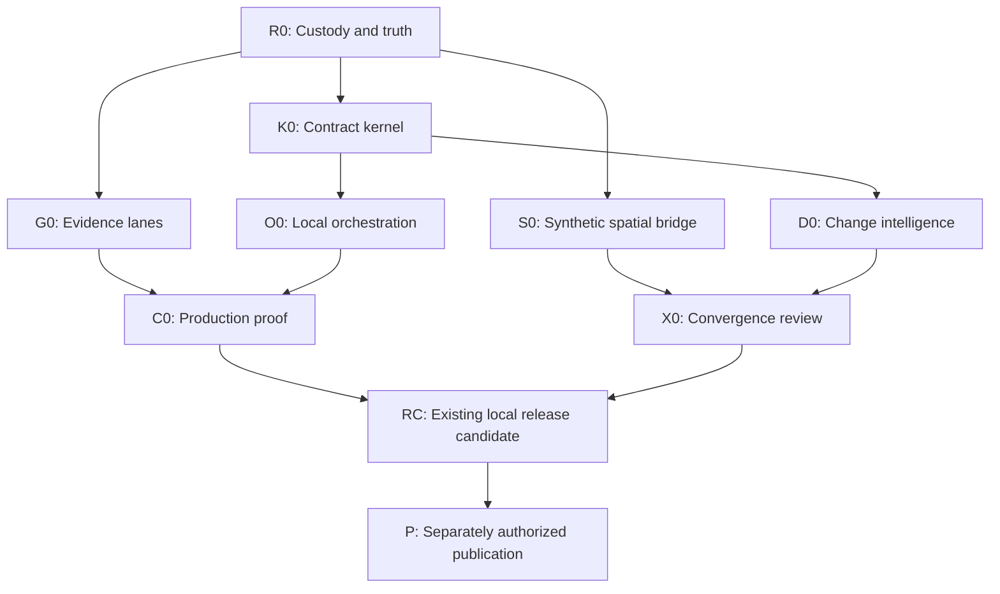

# Policy Sentinel Long-Running Development Program

> **Historical strategy proposal.** This document preserves the 2026-09-01
> program and checkpoint language as evidence. It is superseded for execution
> by [`ROADMAP.yaml`](../ROADMAP.yaml), the
> [PNW scope contract](pnw-scope-and-acceptance.md), and the
> [current continuation prompt](continuation-prompt.md). K0/S0/O0 and the
> unstarted D0 concept are indexed without changing their protected artifacts in
> [`docs/vision/README.md`](vision/README.md).

## Post-deep-dive proposal — 2026-09-01

## Executive conclusion

The Codex deep dive supports a strong but narrow conclusion: Policy Sentinel has a valuable evidence-governance and static-delivery foundation, but it is not yet a production policy-intelligence platform. Its executable application is synthetic-only; all real sources are disabled; no production Nation registry, source orchestrator, policy corpus, GIS engine, subscription system, synthesis engine, public beta, remote, or deployment exists.

The next long-running effort should therefore not begin with GIS, AI, municipal expansion, or production source activation. It should begin by making the existing August work durable and internally consistent. The working tree contains 51 modified tracked files plus 10 untracked status roots representing 21 untracked files. The working `ROADMAP.yaml` is newer than `HEAD`, and the 24-complete/14-blocked/9-not-started state is not yet durable Git history. That custody problem is the first development problem.

After recovery, the best strategy is a **braided evolution**:

- one rail finishes the existing sovereignty-centered source-reference product and its four evidence roots;
- one rail develops additive, synthetic-only lifecycle, orchestration, spatial-observation, and deterministic-change contracts;
- explicit convergence gates decide whether a new capability joins the existing release candidate or remains a separately versioned future capability;
- AI, outbound delivery, private/custom geometry, real Tribal-land data, credentials, publication, and deployment remain closed until separately authorized.

This preserves what is already strongest—the evidence boundary—while preventing external evidence blockers from freezing all useful engineering.

## What the report changes

The report largely validates the earlier roadmap, but it adds five important corrections:

1. **The current checkpoint is not durable.** `HEAD` is still `f6eb61f265823f25be6cabddc379e5461ebd44ba`; the newer ledger, source registry 1.19, Centennial Accord work, and other changes live in a materially dirty worktree.
2. **There are four—not three—local-release evidence roots.** `B5-WA-LWS-ADAPTER` is a required blocked outcome but is omitted from `current_focus`, `next_actions`, and `finish_states.local_release_candidate.blocked_by`.
3. **The roadmap validator has a governance blind spot.** It can accept a terminally blocked ledger that omits an incomplete required-outcome root from its blocker summaries.
4. **Some continuation prose conflicts with binding authority.** Credential use, AI labeling, county-record status, and adapter-null behavior need conservative reconciliation.
5. **The renewed vision can evolve from the current design, but only through independent assertion layers.** Spatial intersection, lifecycle events, classification, alerts, and synthesis cannot be added as extra fields that overwrite or imply Nation identity, jurisdiction, legal effect, or source facts.

## Strategic choices

| Strategy | Description | Strength | Main cost | Recommendation |
| --- | --- | --- | --- | --- |
| Core-first completion | Recover the worktree, resolve the four evidence roots, and finish the current B9/B10 release chain before any vision work. | Lowest architectural and governance risk. | Progress may stall indefinitely on originating evidence and the unavailable Browser backend. | Viable conservative fallback. |
| Braided evolution | Recover first; then run core evidence recovery beside additive synthetic lifecycle, orchestration, spatial-contract, and deterministic-change work. | Preserves the current product while allowing useful progress under blocked sources. | Requires disciplined scope boundaries and convergence gates. | **Recommended.** |
| Vision-forward rewrite | Build a new GIS/service/AI platform and later migrate current provenance logic. | Fastest route to visible prototypes. | Creates a competing system, weakens custody, duplicates contracts, and risks treating geography or models as authority. | Reject. |

## Recommended program architecture

`X0 → RC` does not mean every vision capability automatically becomes part of the existing release. At convergence, each capability is either integrated, retained as an experimental artifact, deferred, or rejected. The core release must never become hostage to optional vision work without an explicit roadmap decision.

## Program invariants

These rules apply across every phase:

- `ROADMAP.yaml` remains the canonical execution ledger; status changes require evidence.
- Existing owner work is preserved and attributed before modification.
- Nation identity and Nation association require exact official evidence.
- Geometry can establish only reproducible geometric relations between versioned geometries.
- Jurisdictional relevance requires a cited administrative or source rule.
- Legal applicability, Nation interest, affiliation, consent, rights impact, eligibility, and predicted outcome remain outside automatic system determination.
- Source facts, deterministic derivations, spatial observations, classifications, editorial judgments, and generated synthesis remain different assertion classes.
- Disabled sources remain disabled until their exact gate is satisfied; omission is represented as a coverage gap, not “no matching policy.”
- Tests demonstrate only the claims they actually exercise. Historical passes remain historical until rerun.
- A local release candidate is not a public beta. Publication, AI, outbound delivery, credentials, private data, land data, and external operations remain separately gated.

---

# Phase R0 — Re-entry, custody, and durable truth

## Purpose

Convert the uncommitted August work into an understood, validated, internally consistent, locally durable checkpoint without discarding or silently rewriting owner work.

## R0.1 — Worktree provenance inventory

Build a manifest for the 51 modified tracked files and the 10 untracked status roots containing 21 files. For every path record:

- path and change type;
- likely work item and source;
- relationship to `HEAD`;
- whether the change is code, test, schema, fixture, generated output, documentation, ledger, or report;
- whether provenance and intended status are clear;
- whether another file depends on it;
- proposed coherent checkpoint group;
- unresolved ownership or authority question.

Do not format, regenerate, delete, reset, stash, or commit before the inventory is reviewed. Unknown changes remain preserved and isolated.

### Acceptance

- Every status entry is accounted for.
- No path is classified solely from filename or agent inference.
- The working ledger, source registry 1.19, Accord work, schemas, tests, and docs have an evidence-backed relationship map.
- A checkpoint plan identifies which changes belong together without changing their content.

### Stop condition

Stop if a material change cannot be attributed to a known work item, report, or owner action and moving forward would risk overwriting it.

## R0.2 — LWS terminal-accounting repair

This is the report’s exact authorized next microtask and should be the first mutation after R0.1.

1. Add `B5-WA-LWS-ADAPTER` to the applicable `current_focus`, `next_actions`, and `finish_states.local_release_candidate.blocked_by` accounting.
2. Add a validator regression proving that terminal-blocked state cannot omit any incomplete required-outcome root.
3. Preserve all 47 work items, their 24/14/9 status counts, every gate state, and all accepted-source-block rules.
4. Keep `B5-WA-LWS-ADAPTER` blocked by `G-WA-LWS-DISCOVERY`.

### Acceptance

- The new negative fixture fails before the validator repair and passes after it.
- `npm run validate:roadmap` passes.
- No source, status, gate, public claim, or release requirement is weakened.
- The diff is isolated and independently reviewed.

## R0.3 — Authority and documentation reconciliation

Resolve each documented inconsistency independently:

- credential language in `docs/continuation-prompt.md` must not override closed gates;
- the exact binding AI label must remain `AI-generated source summary` unless deliberately changed through governance;
- county eligibility must retain the binding final/public requirement;
- credential-gated sources must retain approved contract-first, adapter-null behavior;
- `docs/source-feasibility.md` must reflect the actual current registry version;
- Washington LWS coverage prose should describe completed bounded known-bill work while preserving the discovery block.

Prefer a small set of focused changes over a broad documentation rewrite. Archive or supersede stale prose; do not erase historical decisions.

### Acceptance

- Binding documents and continuation guidance no longer conflict.
- Closed gates remain closed.
- No documentation change promotes synthetic, disabled, or worktree-only capability.
- A fresh session can identify current authority without relying on chat history.

## R0.4 — Reproduction and checkpoint sequence

After scripts and side effects are understood, run the full authorized local checks. Temporary ignored artifact creation is acceptable only within a deliberately authorized implementation session and must be accounted for.

Minimum sequence:

1. roadmap and foundation validation;
2. formatting check, typecheck, lint, and source scan;
3. focused validator regression;
4. full tests;
5. clean production build and artifact validation;
6. dependency/security checks that do not cross closed network or credential boundaries;
7. Git diff and artifact inventory review;
8. browser checks only if the exact required backend exists;
9. adversarial review of authority, provenance, privacy, and release claims.

Create focused local checkpoints only after coherent groups pass their applicable checks. A final R0 checkpoint should make the working ledger and durable Git agree.

### R0 exit gate

- One authoritative local history contains the accepted August work.
- The ledger validator detects omitted required blockers.
- Documentation conflicts are resolved conservatively.
- Current test/build results are distinguished from historical results.
- Any unavailable browser or source evidence remains explicitly blocked.
- The worktree is clean, or every intentionally remaining change is named, owned, and excluded from the checkpoint.

Complexity: **M–L**, driven by the unknown composition of the owner worktree.

---

# Phase G0 — Four independent evidence-recovery lanes

This is not one development phase. The four roots have different authorities, evidence types, and stop conditions. They should be tracked independently so failure in one does not contaminate the others.

## G0-A — BIA identity evidence

Required evidence: an originating authoritative row-level reconciliation between the 577 displayed paragraphs and the stated 575 entities, followed by two independent reviews.

Engineering may maintain the fail-closed validator and prepare review tooling, but it may not infer the mapping from arithmetic, headings, TLD rows, aliases, geography, addresses, grouping, or model output.

Exit: `G-BIA-IDENTITY` is satisfied by exact evidence and review, enabling `B2-IDS`, `B2-STATES`, and `B2-READY`.

## G0-B — Exact built-application browser evidence

Required evidence: desktop and mobile built-artifact behavior using the exact required in-app Browser backend, including keyboard, accessibility, dossier, CSV, Unclassified, same-origin network, contrast, zoom/reflow, print, and screen-reader checks as applicable.

Vitest, jsdom, source inspection, historical smoke, Brave, or another extension surface cannot replace the gate.

Exit: `G-LOCAL-BROWSER` is satisfied and `B4-FR-UX` can complete.

## G0-C — Washington State Register filing contract

Required evidence: a bounded source contract for title, agency, duplicate and holdover behavior, Reviser’s Notes, field-specific dates and forms, relationships, privacy exclusion, official links, and fixed request/byte/chunk/concurrency/deadline/whole-refresh budgets.

No inferred titles, broad crawl, agenda substitution, opaque scraper, or PDF-layout assumption is acceptable.

Exit: the exact gate contract is satisfied; the separately validated Governor adapter remains independently governed.

## G0-D — Washington LWS population discovery

The known-bill SOAP transport and bounded canaries are useful but do not establish a complete population. Required evidence is a trustworthy discovery and whole-refresh reconciliation contract with identity, range, count/limit, date, version, official-link, and failure semantics.

Do not rerun the rejected fixed-year scenario or treat known bills as evidence of completeness.

Exit: `G-WA-LWS-DISCOVERY` is satisfied; only then may adapter completion and production refresh work proceed.

## Shared evidence-lane protocol

Every live or primary-source investigation should begin with a small authorization packet containing:

- exact gate and question;
- official host and endpoint/page;
- terms and reproduction basis;
- fields to observe;
- maximum request, byte, concurrency, retry, and elapsed-time budgets;
- privacy exclusions;
- permitted retention;
- success, ambiguity, and stop dispositions;
- artifact hashes and independent review requirements.

Evidence availability is externally determined. Complexity: **indeterminate**. No calendar promise should be attached to these lanes.

---

# Phase K0 — Additive policy lifecycle contract kernel

## Purpose

Create the domain model needed for multi-stage policy tracking without coercing new meanings into `PolicyRecord.status.normalized`.

## Contracts

- `SourceFact`: immutable source-custodied assertion plus exact provenance.
- `PolicyInstrument`: stable source-qualified identity; no automatic cross-source merge.
- `InstrumentVersion`: official rendition identity, digest, observed/published/effective times where supplied, reproduction basis, and source custody.
- `LifecycleEvent`: source event label/type, actor when supplied, observed time, valid/effective interval, certainty, instrument/version identity, and provenance.
- `EquivalenceAssertion`: reviewed evidence linking source identities without merging them.
- `RelationshipAssertion`: correction, amendment, substitution, withdrawal, supersession, stay, or other typed relation with ambiguity.

## Compatibility

Keep `PolicyRecord 1.4` as a compatibility projection. Projection must be deterministic, versioned, and lossy by declaration. It must refuse to choose one normalized status when concurrent or ambiguous lifecycle evidence cannot be represented safely.

## Fixtures and tests

Use synthetic cases for introduction, hearing, amendment, adoption, signature, publication, effective date, correction, withdrawal, stay, supersession, concurrent versions, missing dates, conflicting sources, and unresolved equivalence.

Test:

- schema and semantic validity;
- stable identity and versioning;
- event ordering without pretending missing time is known;
- ambiguity preservation;
- correction and supersession;
- deterministic replay;
- projection compatibility;
- negative claims about legal applicability or current status.

## Exit gate

- Every renewed lifecycle stage is representable as source fact, deterministic derivation, ambiguity, or unknown.
- No existing record silently changes meaning.
- Current UI/artifacts remain compatible through a tested projection.
- No real source, provider, or AI operation was required.

Complexity: **L**. Owner approval is required before this becomes a canonical roadmap commitment.

---

# Phase O0 — Local production-orchestration foundation

## Purpose

Build the missing source-runner seam using fixtures and disabled adapters before activating any real source.

## Required behavior

- resolve source registry and exact adapter version;
- preflight gate and contract state;
- stage each source independently;
- discover, fetch, normalize, validate, and reconcile under explicit budgets;
- produce bounded receipts, counts, decisions, hashes, and replay manifests;
- promote atomically per source only after validation;
- preserve a verified per-source last-known-good shard on failure;
- distinguish unavailable, stale, degraded, blocked, not monitored, and no matching evidence;
- assemble artifacts only from explicitly promoted shards;
- prohibit disabled or adapter-null sources from emission;
- leave raw corpora and secrets outside Git and public artifacts.

## Tests

Fixture-driven success, partial failure, contract drift, retry exhaustion, duplicate identity, correction, stale LKG, hash mismatch, source isolation, promotion interruption, byte-identical replay, and disabled-source rejection.

## Exit gate

- Fixture sources run end to end through the same orchestration interface intended for production.
- One source failure cannot corrupt or relabel another source’s shard.
- No real source is activated.
- No database or service is introduced unless measured static/local constraints require it.

Complexity: **L**. K0 schema work and O0 runner work may overlap only after interfaces are frozen.

---

# Phase S0 — Synthetic spatial-observation bridge

## Purpose

Prove that spatial intelligence can be added without turning geometry into authority or Nation association.

## Scope

Use deliberately impossible synthetic geometries. Add no real boundary source, Tribal-land geometry, user upload, persistence, map provider, or private data.

## Contracts

- `SpatialObservation`: source/layer/version, feature identity, licensing/attribution, retrieved and valid times, CRS/axis order, geometry digest, resolution/tolerance, uncertainty, and missing-coverage state.
- `SpatialRelation`: intersects, contains, within, touches, disjoint, or unknown between two versioned geometry digests, with algorithm/version/tolerance provenance.
- `JurisdictionEvidence`: a separate cited administrative or source rule; never derived merely from geometry.

## Required negative invariants

A spatial result cannot populate or modify:

- Nation identity or aliases;
- Nation-policy association;
- official jurisdiction;
- source relevance;
- legal applicability;
- rights, consent, affiliation, interest, eligibility, or impact.

## UX

Start with a text/table evidence view and accessible relationship explanation. A map is not part of S0. The nonvisual view should remain the canonical accessibility baseline if maps are later introduced.

## Exit gate

- Property and semantic tests prove non-interference with identity, jurisdiction, policy, and legal-effect fields.
- Geometry and topology are reproducible from versioned inputs.
- Missing/uncertain coverage is explicit.
- The contracts can be removed without changing the current product.

Complexity: **M**. Requires an explicit owner decision after R0.

---

# Phase D0 — Deterministic change intelligence

## Purpose

Establish trustworthy local change and alert semantics before any outbound notification system.

## Contracts and components

- `ChangeEvent`: exact before/after source facts or instrument versions, diff rule, correction/supersession handling, and provenance.
- `AlertRule`: versioned deterministic predicate, timezone, threshold, expiry, and scope.
- `AlertEvent`: triggering fact, rule version, deduplication key, source health, correction/withdrawal state, and expiry.
- Local alert ledger and in-site evidence view.

## Tests

- idempotent replay;
- duplicate and reordered inputs;
- amendment/correction/withdrawal;
- date-only and missing-time-zone boundaries;
- deadline expiry;
- source outage, degraded state, and recovery;
- rule-version changes;
- false urgency and stale-alert prevention.

## Exit gate

- Alerts reproduce deterministically from promoted source facts and stable LKG manifests.
- No recipient, email, webhook, API delivery, consent, or personal state exists.
- `G-I` remains closed.

Complexity: **M**, after K0 and O0 provide stable events and manifests.

---

# Phase E0 — Governed semantic and synthesis experiments

This is deliberately downstream of deterministic contracts.

## Stage E0-A — Deterministic evidence views

Create cross-source and cross-jurisdiction evidence views that display agreements, disagreements, gaps, and provenance without claiming legal conflict, impact, intent, or momentum.

## Stage E0-B — Assertion contracts and offline evaluation

Define `ClassificationAssertion` and `SynthesisArtifact` with method, evidence, confidence semantics, abstention, ambiguity, rule/model/version lineage, review state, exact cited inputs, unsupported-claim checks, and refusal outcomes.

Use synthetic or approved fixed offline outputs only. Do not call a provider. The canonical deterministic taxonomy must remain fully usable when AI is absent.

## Stage E0-C — Separately authorized build-time experiment

Only after an exact owner approval naming provider, model, budget, inputs, retention, review, and evaluation thresholds may a bounded build-time experiment run. Runtime/browser generation remains rejected for the current product.

Generic conflict, impact, intent, or momentum scores remain rejected. A future construct must be separately defined, evidence-bounded, evaluated, and labeled as a hypothesis.

Complexity: **L**. `G-H` remains closed until a separate exact authorization.

---

# Phase C0 — Controlled production proof

This phase begins only as the applicable G0 evidence lanes clear. It should not wait for every optional vision phase.

## Sequence

1. Establish the authoritative 575-Nation registry, stable IDs, official aliases, and official WA/OR/ID crosswalk.
2. Complete Nation registry readiness and negative association tests.
3. Complete the production orchestration seam through fixture parity.
4. Activate one exact source only after its source, terms, reproduction, contract, privacy, and refresh gates are satisfied.
5. Produce a non-synthetic artifact with truthful coverage and health, without claiming comprehensive coverage.
6. Run production single-Nation acceptance.
7. Add controlled long-tail pilots source by source.
8. Enable explicit comparison only after the single-Nation flow passes.
9. Measure representative static scale before selecting a database or service.
10. Exercise weekly/manual refresh locally with per-source isolation and LKG.

## First-source principle

Choose the first production source from currently validated and gate-satisfied repository evidence at execution time. Do not hard-code a preferred source in this plan. The Federal Register adapter is the most mature reported candidate, but present maturity does not itself authorize activation.

## Exit gate

- At least one real source is enabled under its exact contract.
- Production Nation and source evidence are distinct and traceable.
- The artifact build ID and Nation/coverage inputs are explicitly non-synthetic.
- Built-browser, accessibility, security, privacy, artifact, and source-specific evidence passes.
- Failed or disabled sources remain visible as truthful gaps.

Complexity: **XL**, with evidence availability as the critical path.

---

# Phase X0 — Convergence and scope review

Before optional vision work enters the core product, evaluate each capability independently:

| Capability | Possible disposition |
| --- | --- |
| Lifecycle kernel | Integrate if compatibility, provenance, and ambiguity tests pass. |
| Local orchestrator | Integrate when fixture parity and source isolation pass. |
| Spatial contracts | Integrate as dormant/synthetic contracts, retain experimentally, or defer. |
| Deterministic change intelligence | Integrate local-only if replay and false-alert controls pass. |
| Semantic/synthesis contracts | Retain offline unless separately authorized. |
| Map UI | Defer until real boundary authority, terms, accessibility, and scale are approved. |
| Custom polygons | Defer until private-data threat model and non-persistence controls are approved. |
| Outbound delivery | Defer; `G-I` remains closed. |

No optional capability becomes a required outcome in the existing B9/B10 chain merely because code exists.

---

# Phase RC — Existing local release candidate

Complete the established B9/B10 chain with whatever optional capabilities X0 explicitly accepts.

Required evidence includes:

- production-data single-Nation behavior;
- explicit opt-in comparison;
- representative-scale budgets;
- deterministic new/changed/urgent behavior;
- local weekly/manual refresh;
- exact built-browser and accessibility validation;
- source health, coverage, limitation, dossier, print, and CSV correctness;
- source-map, secret, artifact, privacy, and dependency review;
- cooperative and adversarial release review;
- clean worktree and reproducible artifact.

`G-RC` can be satisfied only by current integrated evidence. This does not authorize a license, remote, push, Pages, public deployment, AI, outbound delivery, credentials, or private/land data.

Complexity: **XL**.

---

# Phase P — Separately authorized publication

Publication remains a sequence of owner decisions, not one blanket approval:

1. exact repository license or explicit no-license decision;
2. exact GitHub account, repository, visibility, branch, commit, remote, and non-force push;
3. exact Pages configuration, workflow, permissions, and secrets if any;
4. exact production deployment operation;
5. post-deployment verification of URL, assets, coverage, limitations, same-origin behavior, accessibility, privacy, and security.

Use `gh` exclusively for authorized GitHub operations. Stop if any exact gate remains closed.

---

# Long-running Codex session sequence

The program should use multiple bounded Ultra sessions rather than one enormous implementation run.

| Session | Scope | Mutation authority | Terminal result |
| --- | --- | --- | --- |
| 1 | R0.1 inventory and checkpoint design | Read-only | Owner-work manifest and proposed commit partition |
| 2 | R0.2 LWS accounting and validator regression | Narrow local edits | Passing focused validation; no status/gate changes |
| 3 | R0.3 authority/document reconciliation | Narrow local edits | Binding docs and continuation guidance aligned |
| 4 | R0.4 full reproduction and durable checkpoint | Tests/build/local commits | Current evidence and clean or fully explained worktree |
| 5 | K0 contract design and adversarial review | Plan/schema proposal first | Frozen contract decision packet |
| 6 | K0 implementation and compatibility projection | Local code/tests | Lifecycle kernel passes synthetic suite |
| 7 | O0 orchestrator design/implementation | Local fixture-only code/tests | Replayable per-source runner, no activation |
| 8 | S0 synthetic spatial bridge | Only after owner approval | Contracts and negative non-inference tests |
| 9 | D0 deterministic change intelligence | Local fixture-only code/tests | Replayable local alert ledger, no delivery |
| 10+ | G0 evidence lanes | Exact lane-specific authority | Gate-specific evidence or explicit stopped disposition |
| Later | C0 production proof | Only after exact gates | First non-synthetic source/Nation artifact |
| Later | X0 and RC | Local integration authority | Accepted local RC or explicit blocked disposition |
| Final | P publication | Exact owner approvals | Verified public beta or preserved local RC |

## Subagent pattern for each Ultra session

Use four to six bounded agents rather than a large undifferentiated swarm:

- repository/authority custodian;
- implementation owner for one isolated module;
- test and replay owner;
- privacy/security/adversarial reviewer;
- UX/accessibility reviewer when UI is affected;
- source-contract reviewer when a specific source is involved.

Only the coordinator should integrate overlapping edits. Agents working concurrently should own disjoint paths or remain read-only. Every terminal report should distinguish observed facts, inferences, proposals, historical evidence, and current rerun evidence.

# Program-level acceptance metrics

## Custody and governance

- Zero unexplained owner-work changes.
- Zero omitted incomplete required-outcome roots.
- Zero undocumented gate or scope changes.
- One durable checkpoint and current continuation handoff after each major phase.

## Evidence integrity

- Every source-derived public field has provenance.
- Zero geometry- or model-derived Nation associations.
- Zero automatic cross-source identity merges.
- Ambiguous lifecycle evidence remains ambiguous.

## Replay and operations

- Byte-identical fixture replay where the contract promises determinism.
- Per-source promotion and LKG isolation.
- Disabled sources emit no records or false health/coverage.
- Planned/blocked sources remain visibly distinguishable from no matching evidence.

## Product quality

- Single-Nation remains the default experience.
- Comparison remains explicit and source-equivalent.
- Nonvisual evidence views remain available for any future map-derived result.
- CSV, dossier, print, keyboard, screen-reader, mobile, contrast, and zoom/reflow evidence is current at release.

## Claims discipline

- No legal applicability, comprehensive coverage, Nation interest, rights impact, consent, predicted outcome, or official-source-replacement claims.
- Generated or editorial assertions never become canonical source facts.
- The product remains useful with AI and outbound delivery disabled.

# Decisions needed before execution

## Decision 1 — Program strategy

Recommended: approve **braided evolution**, preserving the current source-reference mission and treating renewed capabilities as additive modules.

## Decision 2 — R0 mutation authority

Authorize only local worktree inventory, the LWS accounting/validator repair, conservative documentation reconciliation, full local reproduction, and focused local commits. This is not source, gate, publication, AI, notification, private-data, or spatial authorization.

## Decision 3 — Lifecycle kernel

After R0, decide whether K0 becomes a canonical roadmap phase. Recommended: yes, because it addresses a demonstrated representational limitation without requiring live sources.

## Decision 4 — Synthetic spatial bridge

After R0, decide whether to authorize S0. Recommended: authorize only impossible synthetic geometry, contract design, table/text UX, and non-inference tests. Keep real boundaries, Tribal lands, uploads, maps, and persistence closed.

## Decisions deliberately deferred

- real boundary providers and layers;
- Tribal-land geometry;
- custom polygons and private deployment;
- municipal expansion;
- AI provider use;
- email, webhook, or API delivery;
- credentials and gated source activation;
- repository license, GitHub, Pages, and publication.

# Immediate recommendation

Begin with **Session 1: R0.1 worktree provenance inventory and checkpoint design**, read-only. Do not begin by editing the LWS ledger, because the report establishes that the ledger itself is part of a larger uncommitted owner worktree. The inventory should confirm that the proposed narrow mutation will not collide with or misattribute existing changes.

Once that inventory is reviewed, run **Session 2: R0.2 LWS terminal-accounting repair and validator regression**. This sequence preserves the report’s exact next microtask while adding the custody step required by the newly discovered worktree state.
